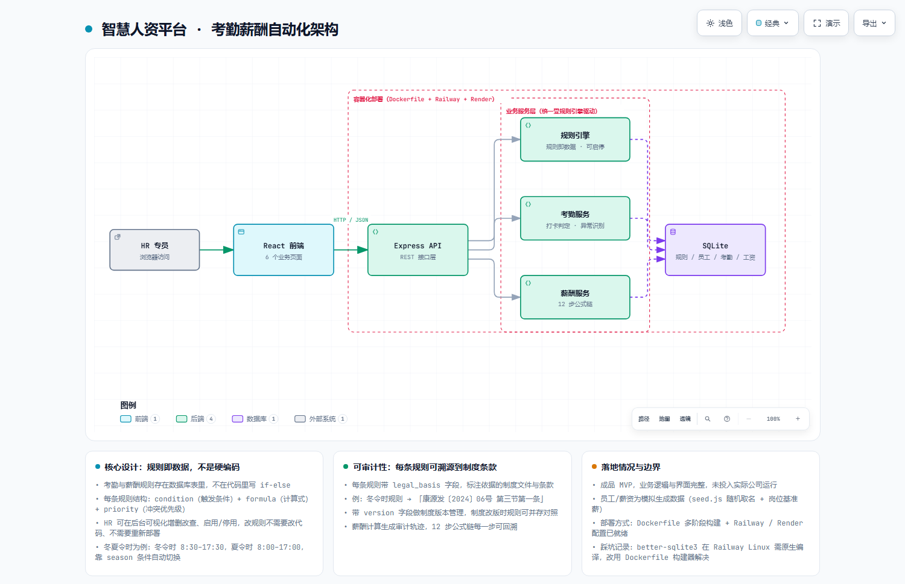

# 智慧人资平台 · Smart HR Platform

> 集团化人力资源管理系统：**考勤判定 + 薪酬核算自动化**，
> 核心是「**规则即数据**」——考勤与薪酬规则存在数据库里、可在后台可视化编辑，改规则不需要改代码。

**React 18 + TypeScript + Tailwind**（前端）· **Node.js + Express + SQLite**（后端）· Docker / Railway / Render 部署配置就绪

> 定位：**成品 MVP**。业务逻辑与界面完整，员工与薪资为模拟生成数据，未投入实际公司运行。

---

## 一、为什么这么做

养老集团的考勤和薪资有两个特点：

1. **规则多且爱变**。冬夏令时作息不同、护理岗有 A/B/C 班、跨天班次、加班折算、各类假别扣减……
   光考勤规则就有几十条，而且制度一改版就要动。
2. **必须可解释**。薪资算错要能说清"这一步依据哪条制度"。HR 不能接受"系统算的，我也不知道为什么"。

如果把这些规则写成代码里的 `if-else`，会立刻遇到三个问题：

- 制度改一条，要改代码、重新测试、重新部署
- 规则散落在各处，没人说得清总共多少条、哪条还生效
- 出了争议无法追溯：当时用的是哪个版本的规则？

所以这个项目把规则**从代码里搬到数据里**。

---

## 二、架构



> 可缩放 / 可导出 SVG 的交互版本：[`docs/architecture.html`](docs/architecture.html)
> 图源规格：[`docs/architecture.json`](docs/architecture.json)

---

## 三、核心设计：规则即数据

规则的存储结构（见 [`server/rules.js`](server/rules.js)）：

```js
{
  rule_id:     'R-ATT-001',
  name:        '标准工时-冬令时',
  category:    'attendance',
  condition:   'shift_type == "normal" && season == "winter"',   // 触发条件
  formula:     'scheduled_start = "08:30"; scheduled_end = "17:30"; lunch_break = 60',
  priority:    10,                    // 冲突时的优先级
  version:     '2024.06',             // 制度版本
  active:      1,                     // 可启停
  description: '冬令时（11月-4月）：8:30-17:30，午休1小时',
  legal_basis: '示例发〔2024〕06号 第三节第一条'    // ← 依据的制度条款
}
```

四个字段是关键：

| 字段 | 解决什么 |
|---|---|
| `condition` + `formula` | 规则可执行——引擎按条件匹配、按公式计算 |
| `priority` | **冲突可解**——多条规则同时命中时谁赢，是数据说了算 |
| `active` + `version` | **可治理**——能停用、能看历史版本、制度改版时新旧并存对照 |
| `legal_basis` | **可审计**——每条规则能溯源到具体制度文件与条款 |

**最实际的效果**：HR 在后台改一条规则，页面立刻生效，不需要开发介入。

举例：夏令时（5–10 月）上班时间是 8:00–17:00，冬令时（11–4 月）是 8:30–17:30。
系统靠 `season` 条件自动切换，不用一年改两次代码。

---

## 四、薪酬计算的 12 步公式链

薪酬不是一次算出来的，是**一串有序的步骤**：

```
出勤天数 → 基本工资 → 岗位津贴 → 加班费 → 各类补贴
   → 社保公积金 → 个税 → 考勤扣款 → 其他增减 → 实发合计
```

每一步的输入、公式、结果都落库，形成**审计轨迹**。

为什么坚持留轨迹：薪资是员工最敏感的数字。出了问题 HR 必须能一步步倒推——
"这个月少了 200，是因为 3 号那天缺卡被扣了全勤"——而不是只能回答"系统算的"。

---

## 五、技术栈与结构

| 层 | 技术 |
|---|---|
| 前端 | React 18 + TypeScript + Vite + Tailwind CSS |
| 后端 | Node.js + Express + better-sqlite3 |
| 规则引擎 | 数据库驱动，动态加载，支持启停与优先级 |
| 部署 | Dockerfile 多阶段构建 + Railway / Render |

```
smart-hr-platform/
├── index.html
├── src/
│   ├── App.tsx
│   └── pages/                 # 6 个业务页面
│       ├── Dashboard.tsx      # 数据看板（员工数/出勤率/人工成本/异常预警）
│       ├── Attendance.tsx     # 考勤管理
│       ├── Salary.tsx         # 薪酬核算
│       ├── Employees.tsx      # 员工档案
│       ├── Payslip.tsx        # 工资单
│       └── Rules.tsx          # 规则引擎（可视化增删改查）
│   └── modules/attendance/    # 教育系统加班引擎（独立规则集）
├── server/
│   ├── index.js               # Express 入口
│   ├── db.js                  # SQLite 初始化
│   ├── rules.js               # ← 规则定义库（452 行）
│   ├── seed.js                # 模拟数据生成器
│   ├── routes/index.js
│   └── services/
│       ├── rule-engine.js     # 引擎：条件匹配 + 优先级裁决
│       ├── attendance.js      # 考勤判定
│       └── salary.js          # 薪酬计算（12 步公式链）
├── Dockerfile
├── railway.json / render.yaml
└── docs/智慧人资平台-使用手册.md
```

---

## 六、快速开始

```bash
npm install
node server/index.js      # 终端 1：后端 API（:3001）
npm run dev               # 终端 2：前端（:5173）
```

Docker：

```bash
docker build -t smart-hr .
docker run -p 3001:3001 smart-hr
```

---

## 七、已知边界（诚实写在这里）

1. **未投入实际业务运行**。这是成品 MVP，逻辑与界面完整，但没有在生产环境跑过真实数据。
2. **员工与薪资是模拟数据**（`seed.js` 随机取名 + 岗位基准薪），
   组织架构（4 个主体、8 个分支、8 个部门）是真实的。
3. **没有单元测试**。规则引擎、薪酬计算这类核心逻辑最该有测试，
   目前是手工验证。这是下一步第一优先要补的。
4. **规则 DSL 是字符串表达式**，靠约定的写法解析，不是真正的表达式引擎。
   规则复杂到一定程度会难以维护，届时应换成结构化 DSL（AST）。
5. **无权限体系**。任何人都能进后台改规则。生产化必须加登录与操作审计。
6. **SQLite 单文件**，多实例部署会有写入冲突，需要换 PostgreSQL。

---

## License

MIT
